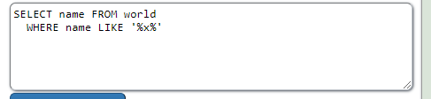
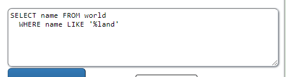
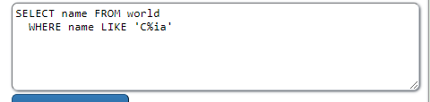
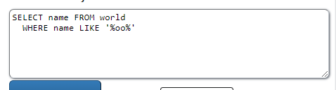
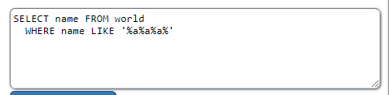
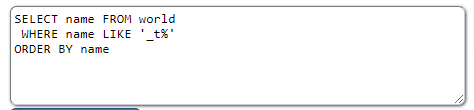
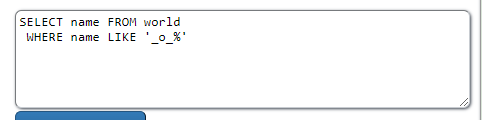

<h2>m) Voluntary bonus: Pick your tasks from SQLZoo 1, 3-9.</h2>

<h3>SQLZoo 1</h3>

3.

added `WHERE name LIKE '%x%'`, %x% allows for unlimited characters on both sides

4.

added `WHERE name LIKE '%land'`,%land allows for unlimited characters before land ending

5.

added `WHERE name LIKE 'C%ia'`, C%ia allows for unlimited characters between C and ia

6.

added `WHERE name LIKE '%oo%'`, %oo% allows for unlimited characters on both sides

7.

added `WHERE name LIKE '%a%a%a%`, %a%a%a% allows for unlimited characters on both sides of all of the a characters

8.

added ` WHERE name LIKE '_t%'`, _t% allows for exactly 1 character before t and unlimited after

9.

added `WHERE name LIKE '_o_%'`, _o_% allows for exactly one characters before and after o and then unlimited after them.

