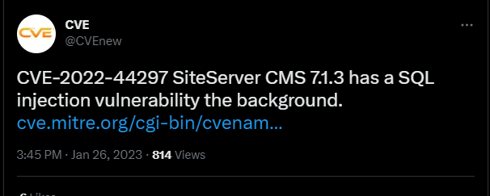
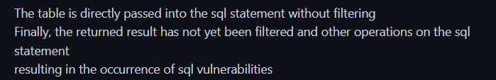
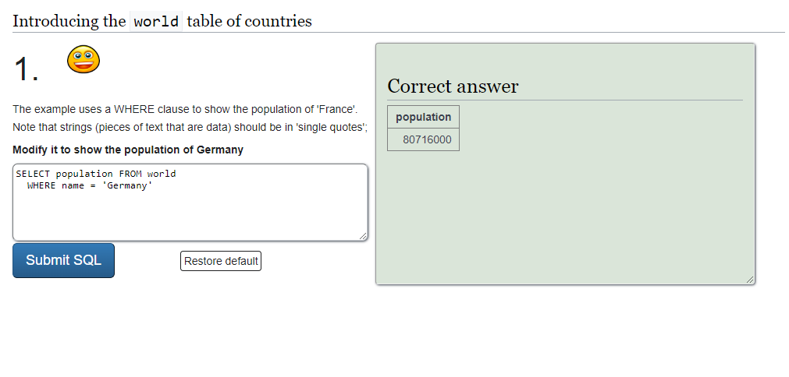
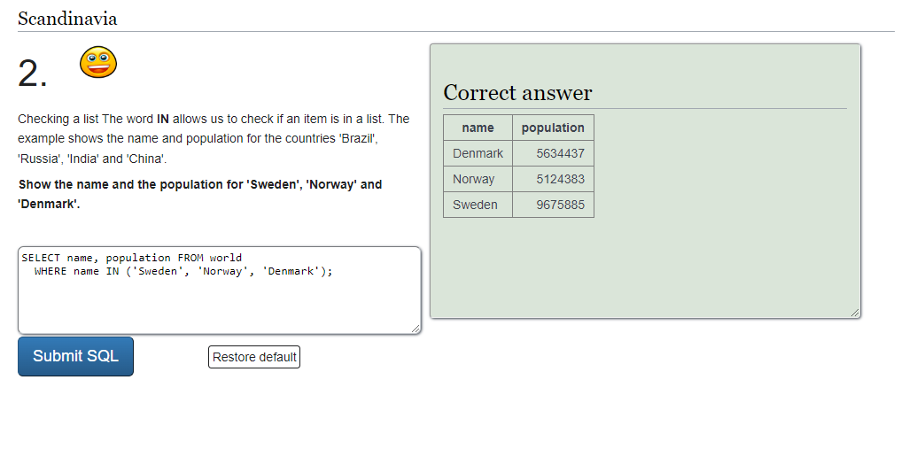
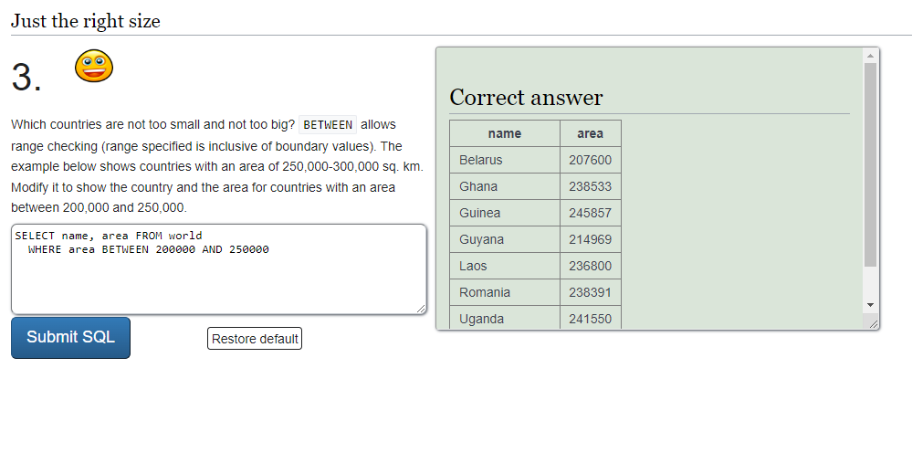
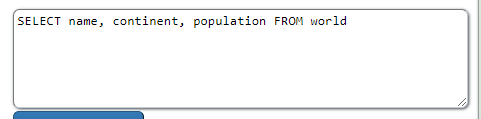
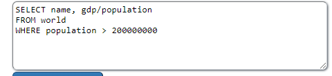
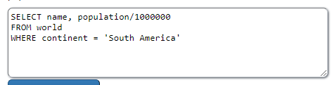
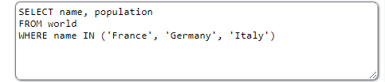

<h1>H2 Goat </h2>
<h2>x) read and summarize</h2>

<h3>Security Misconfiguration</h3>
Vulnerabilities include:

- Unnecessary features are enabled or installed
- Default accounts are still enabled
- Errors give out too much information to user
- Latest security features are not used correctly

Prevention examples:

- Minimize unnecessary features, components, docs etc.
- Automate a process for verifying settings and configurations effectiveness
- Automate a repeatable hardening process
- Segment application architecture

<h4>Source</h4>
https://owasp.org/Top10/A05_2021-Security_Misconfiguration/

<h3>Vulnerable and Outdated Components</h3>

Vulnerabilities include:

- Component versions are unknown
- Outdated, unsupported or otherwise vulnerable software (components, libraries, apps etc.)
- Scans are not done regularly to find vulnerabilities

Prevention examples:

- Remove everything that’s unused (dependencies, components etc.)
- Keep and update inventory of both server- and client-side components
- Use only reliable and secured sources for components

<h4>Source</h4>

https://owasp.org/Top10/A06_2021-Vulnerable_and_Outdated_Components/

<h3>Injection</h3>

Vulnerabilities include:

- Unproper user
- Supplied data handling (not validated etc.)

Prevention examples:

- Prefer to use a safe API
- Utilize positive server-side input validation
- Use SQL controls that prevent mass disclosure of records, like for example LIMIT

<h4>Source</h4>
https://owasp.org/Top10/A03_2021-Injection/

<h2>Darknet Diaries</h2>

<h2>CVE</h2>

I followed the tweet link to the original post on GitHub and there was the following explanation of the injection by user nolan124:

A classic case of not filtering/protecting SQL data, making it possible for someone to inject malignent SQL commands to gather excess information from the source. 

<h4>Source</h4>

https://twitter.com/CVEnew/status/1618605980354224128
https://github.com/siteserver/cms/issues/3490

<h2>a) Sequel. Solve SQLZoo:</h2>
<h3>0 SELECT basics</h3>

0.Introducing the world table of countries

changed ` WHERE name= 'Germany`

2.Scandinavia

changed ` WHERE name IN  ('Denmark', 'Norway', 'Denmark');`

3.Just the right size

changed ` WHERE area BETWEEN 200000 AND 250000`

<h2>2 SELECT from World</h2>

1.

Nothing to really change

2.

changed `WHERE population > 200000000`

3.

changed `WHERE population > 200000000` and added `gdp/population`

4.

changed `WHERE continent = 'South America'` and added `population/1000000`

5.

changed `WHERE name IN ('France', 'Germany', 'Italy')`

<h2>Bonus tasks</h2>
