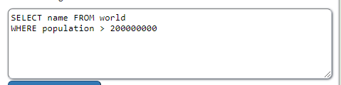

<h1>H2 Goat </h2>
<h2>x) read and summarize</h2>

<h3>Security Misconfiguration</h3>
Vulnerabilities include:

- Unnecessary features are enabled or installed
- Default accounts are still enabled
- Errors give out too much information to user
- Latest security features are not used correctly

Prevention examples:

- Minimize unnecessary features, components, docs etc.
- Automate a process for verifying settings and configurations effectiveness
- Automate a repeatable hardening process
- Segment application architecture

<h4>Source</h4>
https://owasp.org/Top10/A05_2021-Security_Misconfiguration/

<h3>Vulnerable and Outdated Components</h3>

Vulnerabilities include:

- Component versions are unknown
- Outdated, unsupported or otherwise vulnerable software (components, libraries, apps etc.)
- Scans are not done regularly to find vulnerabilities

Prevention examples:

- Remove everything that’s unused (dependencies, components etc.)
- Keep and update inventory of both server- and client-side components
- Use only reliable and secured sources for components

<h4>Source</h4>

https://owasp.org/Top10/A06_2021-Vulnerable_and_Outdated_Components/

<h3>Injection</h3>

Vulnerabilities include:

- Unproper user
- Supplied data handling (not validated etc.)

Prevention examples:

- Prefer to use a safe API
- Utilize positive server-side input validation
- Use SQL controls that prevent mass disclosure of records, like for example LIMIT

<h4>Source</h4>
https://owasp.org/Top10/A03_2021-Injection/

<h2>Darknet Diaries</h2>

<h3>Information about the person being interviewed</h3>

- Troy Hunt is a web security consultant from Australia. His website, https://haveibeenpwned.com/, collects information about data breaches and allows users to search by email to see if their account has been compromised. The website has been up and running since 2013. According to Hunt, as of 2019, there have been approximately 4 billion unique emails involved in data breaches over the last ten years.

<h3>RockYou</h3>

- The interviewer makes guesses/speculations about how hackers come to be, making a comparison between security professionals and hackers, saying that "They're really two sides of the same coin". The New York Times introduces a character named Tom. He may have had a similar start to many other hackers, being interested in technology from a young age and becoming a security professional before becoming truly interested in malicious hacking.

- He truly began by starting to testing different sites for having vulnerabilities for certain attacks. He discovered that he could inject SQL commands into the csfd.cz login page and thus gain access to all of the site's user data. At the time, the site had 187000 users (2009).

- He carried out numerous other attacks similar to the first and began posting about them on BayWords under the alias IGIGI. He later discovered through this community that the Rockyou.com website was vulnerable to SQL injection. Because Rockyou was integrated into the user's social media, it required access to the user's Facebook or MySpace pages, making it a very valuable target.

- Rockyou had major security issues and mishaps, such as emailing the entire ad partner list to all of their business partners three times in a row and having poor password security that only required a minimum of 5 characters and no special characters. 

- Tom was able to access the information of millions of Rockyou users by using a simple SQL injection, which was very similar to the one demonstrated in the Phrack magazine 11 years before this occurrence. Amichai Shulman, co-founder of Imperva, informed Rockyou about the vulnerability too late.

- Tom ended up with the account information for 32 million users. He posted about it after the company falsely claimed that the security issue had been resolved. Worst of all, all of the user passwords were stored in plain text. They also saved all of the users' social media login details. This information was also in plain text. Tom eventually posted only the passwords to RapidShare. Tom's breach was the fifth largest at the time.

<h3>Notable facts:</h3>

- This information was later used to evaluate users' password habits at the time. Common passwords were 12345, Password, RockYou, and 654321.

- RockYou was fined $250,000, due to leaked user information including children. (children’s records storing has own laws) RockYou was forced to delete all information of users under 13 ad was forced to undergo security audits from a third party every other year for the next twenty years.

- Tom vanished, and this is regarded as one of the most significant turning points in how we think about password cracking even today.

<h4>Source</h4>
https://darknetdiaries.com/episode/33/

https://darknetdiaries.com/transcript/33/

<h2>CVE</h2>

I followed the tweet link to the original post on GitHub and there was the following explanation of the injection by user nolan124:

A classic case of not filtering/protecting SQL data, making it possible for someone to inject malignent SQL commands to gather excess information from the source. 

<h4>Source</h4>

https://twitter.com/CVEnew/status/1618605980354224128
https://github.com/siteserver/cms/issues/3490

<h2>a) Sequel. Solve SQLZoo:</h2>
<h3>0 SELECT basics</h3>

0.Introducing the world table of countries

changed ` WHERE name= 'Germany`

2.Scandinavia

changed ` WHERE name IN  ('Denmark', 'Norway', 'Denmark');`

3.Just the right size

changed ` WHERE area BETWEEN 200000 AND 250000`

<h2>2 SELECT from World</h2>

1.

Nothing to really change. Basic select.

2.

changed `WHERE population > 200000000`

3.

changed `WHERE population > 200000000` and added `gdp/population`

4.

changed `WHERE continent = 'South America'` and added `population/1000000`

5.

changed `WHERE name IN ('France', 'Germany', 'Italy')`

<h2>A1 Injection (intro)</h2>

2.

To get Bobs department, I used the WHERE clause to target his first name.

3.

Updated Tobis department to Sales by targeting his first_name in the WHERE clause.

4.

ALTER TABLE to target employees-table and ADD phone varchar(20).

5.

Simple permission granting to the UnauthorizedUser

9.

My choises, because '1' = '1' always evaluates to true. Basically anything that is true is returned.

the rest of this task will be possibly completed later...

Thanks for reading!

<h2>Bonus tasks</h2>

m) https://github.com/oskariruo/H2/blob/main/Bonus_m.md

o) https://github.com/oskariruo/H2/blob/main/Bonus_o.md

q) https://github.com/oskariruo/H2/blob/main/Bonus_q.md

r) https://github.com/oskariruo/H2/blob/main/Bonus_r.md
